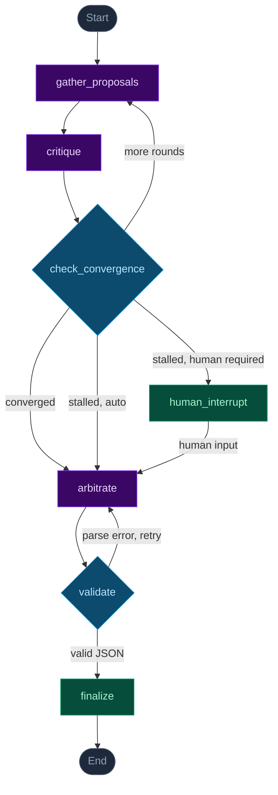

# WeekForge — LangGraph Workflow

三个 CrewAI debater → 收敛检测 → Arbiter 仲裁 → 验证 → 输出排期

## Node Reference

| Node | Role | Implementation |
|---|---|---|
| `gather_proposals` | DeadlineHawk / EnergyGuardian / FocusBatcher each propose a weekly schedule | CrewAI |
| `critique` | Each debater critiques the others' proposals | CrewAI |
| `check_convergence` | Judges if proposals have converged (yes/no); triggers human interrupt or auto-arbitration on stall | Claude Haiku |
| `human_interrupt` | Pauses graph execution via `langgraph.interrupt()`, waits for user input over SSE | LangGraph |
| `arbitrate` | Arbiter synthesises all proposals and critiques into a JSON time-block array | CrewAI |
| `validate` | Parses Arbiter's free-text output into valid JSON; loops back to `arbitrate` with the error on failure | Claude Haiku |
| `finalize` | Writes Schedule to state; SSE pushes it to the frontend calendar view | LangGraph |

## Color Key

- **Purple** — CrewAI agents (debaters + Arbiter); model configured via `WEEKFORGE_MODEL`, defaults to Haiku
- **Blue** — Claude Haiku utility calls (convergence check = 10 tokens; validate = JSON parsing)
- **Green** — LangGraph infrastructure (interrupt checkpoint + finalize terminal node)
